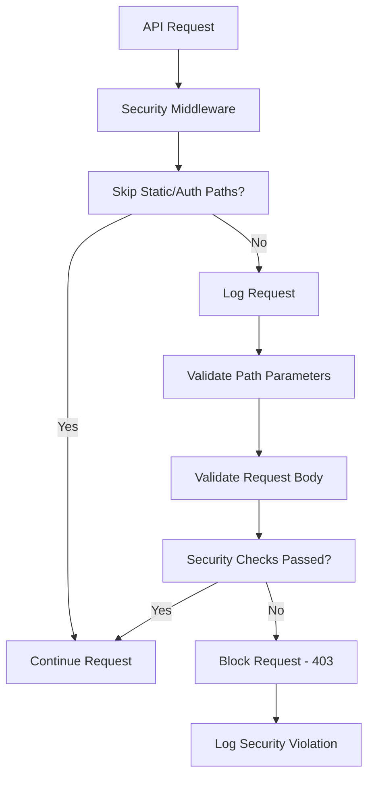

# File Access Control System 0.1 - Security Documentation

## Overview

This document describes the File Access Control System implemented to prevent AI from accessing files outside the designated workspace. This is a **non-negotiable security measure** that enforces strict boundaries on file system access.

## System Architecture

### Core Components

1. **File Access Control (`lib/security/file-access-control.ts`)**
   - Validates all file paths against workspace boundaries
   - Prevents path traversal (`..`) and absolute path access outside workspace
   - Provides utility functions for safe path operations

2. **Security Middleware (`middleware.ts`)**
   - Runs on ALL API requests to enforce security policies
   - Validates path parameters and request bodies
   - Blocks suspicious file access attempts

3. **Security Configuration (`lib/security/config.ts`)**
   - Centralized security policy definitions
   - Configurable restrictions and validation rules
   - Security headers and file operation limits

4. **Audit Logger (`lib/security/audit-logger.ts`)**
   - Logs all security-related events
   - Provides audit trail for compliance
   - Tracks violations and access attempts

5. **Security Dashboard (`app/api/security/dashboard/route.ts`)**
   - Monitoring interface for security events
   - Statistics and violation reporting
   - Path validation testing

## Security Policies

### Workspace Boundary Enforcement

**Rule**: AI can ONLY access files within the workspace root directory.

- **Workspace Root**: `process.cwd()` (current working directory)
- **Blocked Operations**: 
  - Path traversal (`../`, `..\`)
  - Absolute paths outside workspace
  - Symbolic links (if implemented)

### Path Validation Process

1. **Input Resolution**: All paths are resolved to absolute paths using `path.resolve()`
2. **Boundary Check**: Verify resolved path starts with workspace root
3. **Traversal Check**: Reject paths containing `..` sequences
4. **Absolute Path Check**: Reject absolute paths outside workspace
5. **Logging**: All attempts are logged for audit purposes

### File Operation Restrictions

- **Maximum File Size**: 10MB
- **Blocked File Patterns**: `.env*`, `*.key`, `*.pem`, `*.crt`, `config.json`, `secrets.json`, `credentials.json`
- **Allowed Extensions**: No restriction (configurable)

## Implementation Details

### Security Middleware Flow



### Path Validation Logic

```typescript
function validateWorkspacePath(inputPath: string): string {
  const resolvedPath = path.resolve(inputPath)
  const isWithinWorkspace = resolvedPath.startsWith(WORKSPACE_ROOT)
  const hasPathTraversal = inputPath.includes('..')
  const isAbsoluteOutsideWorkspace = path.isAbsolute(inputPath) && !resolvedPath.startsWith(WORKSPACE_ROOT)
  
  if (!isWithinWorkspace || hasPathTraversal || isAbsoluteOutsideWorkspace) {
    throw new Error('ACCESS_DENIED: Path outside workspace boundaries')
  }
  
  return resolvedPath
}
```

## Security Monitoring

### Audit Events

The system logs four types of security events:

1. **ACCESS_ATTEMPT**: Normal file access attempts
2. **VIOLATION_BLOCKED**: Blocked security violations (CRITICAL)
3. **PATH_VALIDATED**: Successful path validations
4. **CONFIG_CHANGE**: Security configuration changes

### Security Dashboard

Accessible at `/api/security/dashboard`, provides:

- Real-time security statistics
- Recent security events
- Violation reports
- Path validation testing
- Workspace boundary information

## Testing Security

### Manual Testing

```bash
# Test valid path (should succeed)
curl -X POST /api/security/dashboard \
  -H "Content-Type: application/json" \
  -d '{"action":"test_path","path":"./test.txt"}'

# Test invalid path (should fail)
curl -X POST /api/security/dashboard \
  -H "Content-Type: application/json" \
  -d '{"action":"test_path","path":"../outside.txt"}'
```

### Automated Security Tests

The system automatically tests these scenarios:
- `../outside.txt` - Path traversal
- `/etc/passwd` - Absolute path outside workspace
- `./test.txt` - Valid relative path
- `process.cwd()` - Current workspace path

## Security Headers

The system enforces these security headers:
- **Content-Security-Policy**: Restricts resource loading
- **X-Content-Type-Options**: Prevents MIME type sniffing
- **X-Frame-Options**: Prevents clickjacking
- **X-XSS-Protection**: Enables XSS protection

## Compliance and Monitoring

### Audit Trail

All security events are logged with:
- Timestamp
- Event type and severity
- Operation details
- Path information
- User context (when available)

### Violation Response

When violations are detected:
1. **Immediate Block**: Request is terminated with 403 error
2. **Detailed Logging**: Full violation details logged server-side
3. **Audit Recording**: Event stored in security audit log
4. **Monitoring Alert**: Critical violations trigger console alerts

## Configuration

### Security Settings

```typescript
const SECURITY_CONFIG = {
  WORKSPACE_ROOT: process.cwd(),
  PATH_VALIDATION: {
    BLOCK_PATH_TRAVERSAL: true,
    BLOCK_ABSOLUTE_OUTSIDE_WORKSPACE: true,
    BLOCK_SYMLINKS: true,
  },
  FILE_RESTRICTIONS: {
    BLOCKED_PATTERNS: ['.env*', '*.key', '*.pem', '*.crt'],
    MAX_FILE_SIZE: 10 * 1024 * 1024, // 10MB
  }
}
```

## Best Practices

### For Developers

1. **Always use provided utilities** for file operations
2. **Never bypass security checks** in production code
3. **Test path validation** for all file-related APIs
4. **Monitor security logs** regularly
5. **Report suspicious patterns** immediately

### For System Administrators

1. **Regular security audits** using the dashboard
2. **Monitor violation rates** and investigate spikes
3. **Review blocked attempts** for potential threats
4. **Update blocked patterns** as needed
5. **Maintain security documentation**

## Non-Negotiable Rules

This security system operates under these absolute rules:

1. **No path traversal** - `..` sequences are always blocked
2. **Workspace confinement** - Only workspace root and subdirectories accessible
3. **Absolute path restriction** - Paths outside workspace root are blocked
4. **Complete logging** - All access attempts are logged
5. **Immediate blocking** - Violations are blocked without exception
6. **No user override** - Security cannot be bypassed by user requests

## Emergency Procedures

### If Security is Compromised

1. **Immediate shutdown**: Stop the application
2. **Investigate logs**: Review security audit trail
3. **Assess damage**: Determine what files may have been accessed
4. **Update security**: Strengthen validation rules
5. **Restart with enhanced monitoring**: Deploy updated security measures

### Security Incident Response

1. **Document the incident** in security logs
2. **Analyze the attack vector** using audit data
3. **Implement additional protections** if needed
4. **Review and update policies** based on findings
5. **Conduct post-incident review** with team

---

*This security system is designed to be robust, transparent, and non-bypassable. It represents the minimum security baseline for AI file system access.*